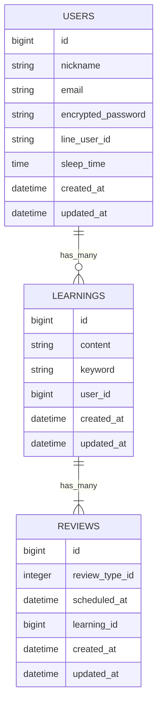

👇

# 📚 寝る前ドリル（仮）

## ■ アプリ概要
本アプリはエビングハウスの忘却曲線を参考に、
学習内容の復習タイミングを自動管理する学習支援アプリです。

ユーザーは単語や知識を登録し、「思い出した！」ボタンを押すことで復習段階が進行し、
最適なタイミングで繰り返し学習できる設計になっています。
スマホでの使用と使用時間を考慮したレイアウトとを意識しました。
##  ■ 使用技術
- Ruby on Rails 7
- MySQL
- JavaScript（fetchによる非同期通信）
- ActiveHash
- Tailwind CSS
## ■ ER図
**環境により表示されない場合、別途nerumae_drill_ER.dioを参照してください

## ■ データ設計の意図
### ① USERS

ユーザー情報および学習習慣（睡眠時間など）を保持し、
個別に学習データを管理できるようにしています。

### ② LEARNINGS

学習の最小単位（単語・知識）を管理するテーブルです。

content：覚える内容
keyword：答え（想起用）

ユーザーごとに学習データを持つ構造にしています。

### ③ REVIEWS
復習スケジュールと進捗管理を担う中心テーブルです。

review_type_id：復習フェーズ

**ActiveHashで管理することで軽量化、コードの一貫性を重視**

想起 → 理解 → 応用 → 完了
scheduled_at：次回復習タイミング
## ■ 設計の特徴
### ① 忘却曲線的設計

scheduled_at を用いることで、
時間経過に応じた復習タイミングを管理しています。

### ② 状態遷移型学習モデル

review_type_id を利用し、
「想起 → 理解 → 応用 → 完了」と段階的に学習を進める設計にしています。

### ③ ActiveHashによる擬似マスタ管理

復習段階（review_type）はマスタテーブルを作らず、
ActiveHashで軽量に管理しています。

### ④ 非同期UX

「思い出した！」ボタン押下時にfetch通信を用いて
復習状態をリアルタイムで更新しています。

## ■ 工夫した点
- 学習と復習を分離したデータ設計
- 状態（review_type）による進行管理
- 時間（scheduled_at）による復習制御
- フロント（JS）とバック（Rails）の連携設計
## ■ 今後の改善予定
- 復習アルゴリズムの最適化
- 通知機能（LINE連携）
- 学習進捗の可視化UI追加