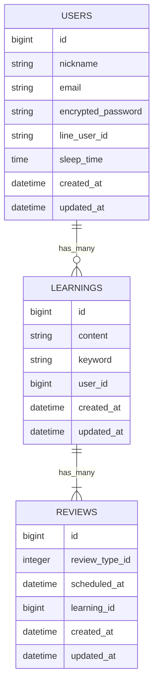

# 📚 ねるまえドリル

## ■　テスト用アカウント
Email: suzuki@gmail
password: suzuki1111

## ■ アプリ概要
本アプリはエビングハウスの忘却曲線を参考に、
学習内容の復習タイミングを自動管理する学習支援アプリです。

ユーザーは単語を登録し、「思い出した！」ボタンを押すことで復習段階が進行、1日目、3日後、7日後という最適なタイミングで繰り返し学習できる設計になっています。
企画時に想定したペルソナを元に、スマホ前提のUIと使用時間を考慮したデザインに仕上げました。

## ■ 未実装・制限事項
- LINE通知機能はローカル環境（development）で動作確認済み
- Renderの無料プランではCron Jobが利用できないため、本番環境での自動通知は未設定
- 有料プランへの移行、またはHeroku Schedulerへの切り替えで対応予定

##  ■ 使用技術
- Ruby on Rails 7
- MySQL
- JavaScript（fetchによる非同期通信）
- ActiveHash
- Tailwind CSS
## ■ ER図
**環境により表示されない場合、別途nerumae_drill_ER.dioを参照してください

## ■ データ設計の意図
### ① USERS

ユーザー情報および学習習慣（睡眠時間など）を保持し、
個別に学習データを管理できるようにしています。

### ② LEARNINGS

学習の最小単位を管理するテーブルです。

content：覚える内容
keyword：答え

### ③ REVIEWS
復習スケジュールと進捗管理を担う中心テーブルです。
確認 → 想起 → 理解 → 応用 → 完了の順に進行します。
**ActiveHashで管理することで軽量化、コードの一貫性を重視しました**

## ■ 設計の特徴
### ① 忘却曲線的設計

scheduled_at を用いることで、
時間経過に応じた復習タイミングを管理しています。

### ② 状態遷移型学習モデル

review_type_id を利用し、
「想起 → 理解 → 応用 → 完了」と段階的に学習を進める設計にしています。

### ③ ActiveHashによる擬似マスタ管理

復習段階をマスタテーブル化せず、
ActiveHashで軽量に管理しています。

### ④ 非同期UX

「思い出した！」ボタン押下時にfetch通信を用いて
復習状態を更新しています。

## ■ 工夫した点
- 学習と復習を分離したデータ設計
- 状態（review_type）による進行管理
- 時間（scheduled_at）による復習制御
- フロント（JS）とバック（Rails）の連携設計
## ■ 今後の改善予定
- 復習アルゴリズムの最適化
- LINE連携及び睡眠時間に即した通知機能
- 継続期間の可視化 **7/14,claudを用いた開発に慣れるために実装**
- AIに依拠したコードの言語化
